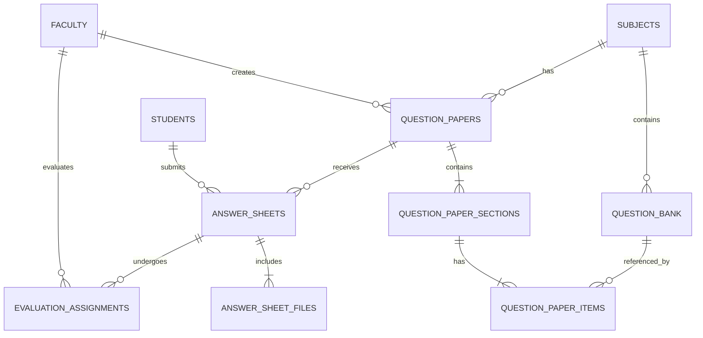
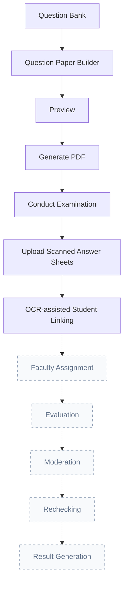

<div align="center">
  
# 🎓 University Evaluation Management System (UEMS)

*A comprehensive web-based platform designed to streamline and automate the entire university examination lifecycle.*

[](#)
[](#)
[](#)
[](#)
[](#)
[](#)
[](#)

</div>

<br />

**UEMS** is a modern, responsive web application developed to handle the complex workflows of university examinations. From managing question banks and generating question papers to handling the upload, OCR-assisted linking, and management of student answer sheets, UEMS brings traditional examination workflows into the digital age.

## 🌐 Demo

> This project is currently under active development as part of an internship.
>
> A live deployment is not yet available.
>
> Screenshots and demonstration videos will be added upon project completion.

## ⭐ Key Highlights

✔ **Modular React Architecture**  
✔ **Professional Question Paper Builder**  
✔ **OCR-assisted Student Identification**  
✔ **Automatic PDF Generation**  
✔ **Integrated PDF Viewer**  
✔ **Responsive Admin Dashboard**  
✔ **Scalable Examination Workflow**  

---

## 📑 Table of Contents

- [Project Statistics](#-project-statistics)
- [Features](#-features)
- [Technology Stack](#-technology-stack)
- [Database Design](#-database-design)
- [Project Structure](#-project-structure)
- [Installation](#-installation)
- [Application Workflow](#-application-workflow)
- [Screenshots](#-screenshots)
- [Current Development Status](#-current-development-status)
- [Future Roadmap](#-future-roadmap)
- [Acknowledgements](#-acknowledgements)
- [Author](#-author)
- [License](#-license)

---

## 📈 Project Statistics

- **React Components / Pages** : 45
- **API Endpoints** : 35
- **Database Tables** : 11
- **Modules Completed** : 14
- **Modules Planned** : 5

---

## ✨ Features

### Administration
- **Dashboard**: High-level overview of examination statistics.
- **Student Management**: Manage student profiles, roll numbers, and candidate codes.
- **Faculty Management**: Manage faculty members and subject assignments.
- **Subject & Course Management**: Structured hierarchies for courses, programs, and subjects.

### Question Bank & Paper Generation
- **Question Bank**: Centralized repository of questions categorized by subject, module, and difficulty.
- **Question Paper Management**: Create, edit, and organize question papers.
- **Manual Paper Builder**: Intuitive drag & drop question arrangement.
- **Auto Generate Assistant**: Automatically assemble papers based on intelligent blueprints.
- **Question Replacement & Validation**: Ensure papers meet blueprint constraints and easily swap out questions.
- **Internal Choice Configuration**: Configure alternative OR questions within sections.
- **Question Paper Preview**: High-fidelity, real-time preview of the final paper.
- **Professional PDF Generation**: Generate perfectly formatted PDFs ready for printing.

### Examination Answer Sheets
- **Examination Directory**: Dedicated directory for all examinations with live evaluation statistics.
- **Bulk & Single Upload**: Easily upload scanned answer booklets.
- **Integrated PDF Viewer**: Custom PDF.js integration to read answer sheets directly in the browser.
- **OCR-assisted Student Linking**: Local Tesseract OCR integration to automatically detect student information (Roll Number, Candidate Code) from scanned booklets.
- **Duplicate Validation & Safe Deletion**: Ensure data integrity with duplicate checks and protected deletion workflows.
- **Student Search**: Fallback manual linking via contextual student search.

---

## 💻 Technology Stack

| Layer | Technologies |
| :--- | :--- |
| **Frontend** | React, Vite, React Router DOM |
| **UI** | Vanilla CSS, Context API |
| **Backend** | Node.js, Express.js |
| **Database** | MySQL |
| **OCR** | Tesseract.js |
| **PDF** | html2pdf.js, react-pdf |
| **Uploads** | Multer |

---

## 🗄️ Database Design



---

## 📁 Project Structure

```text
university-evaluation-management-system/
├── backend/                  # Node.js Express Server
│   ├── services/             # Core backend services (OCR, PDF, etc.)
│   ├── uploads/              # Local storage for Answer Sheets
│   ├── db.js                 # Database configuration
│   └── server.js             # Main server entry & API routes
├── src/                      # React Frontend
│   ├── components/           # Reusable UI components
│   ├── pages/                # Page components
│   │   ├── answersheets/     # Examination Answer Sheets Module
│   │   ├── preview/          # PDF Preview Module
│   │   └── ...               # Administration Modules
│   ├── App.jsx               # Application Routing
│   └── main.jsx              # React Entry Point
├── package.json              # Frontend dependencies
└── README.md                 # Project documentation
```

---

## 🚀 Installation

### Prerequisites
- Node.js (v18+ recommended)
- MySQL Server
- npm or yarn

### Database Setup
1. Create a MySQL database (e.g., `uems_db`).
2. Import the provided schema (if available) or rely on backend initialization scripts to set up tables.
3. Configure your MySQL credentials in the backend environment/configuration files.

### Backend Setup
```bash
cd backend
npm install
node server.js
```
*The backend server typically runs on `http://localhost:5000`.*

### Frontend Setup
Open a new terminal window:
```bash
npm install
npm run dev
```
*The Vite development server will start, usually on `http://localhost:5173`.*

---

## 🔄 Application Workflow



---

## 📸 Screenshots


*(Actual screenshots will replace these placeholders shortly)*

---

## 📊 Current Development Status

| Module | Status |
| :--- | :--- |
| **Dashboard** | ✅ Completed |
| **Student Management** | ✅ Completed |
| **Faculty Management** | ✅ Completed |
| **Subject Management** | ✅ Completed |
| **Course Management** | ✅ Completed |
| **Question Bank** | ✅ Completed |
| **Question Paper Management** | ✅ Completed |
| **Manual Paper Builder** | ✅ Completed |
| **Auto Generate Assistant** | ✅ Completed |
| **Question Paper Preview** | ✅ Completed |
| **Professional PDF Generation** | ✅ Completed |
| **Examination Directory** | ✅ Completed |
| **Examination Answer Sheets** | ✅ Completed |
| **OCR-assisted Student Linking** | ✅ Completed |
| **Faculty Assignment** | 🚧 Planned |
| **Digital Evaluation** | 🚧 Planned |
| **Moderation** | 🚧 Planned |
| **Rechecking** | 🚧 Planned |
| **Results Processing** | 🚧 Planned |

---

## 🚀 Future Roadmap

The following features are part of the long-term roadmap and are **NOT** yet implemented:

- **Faculty Assignment & Workload Balancing**
- **Digital Answer Sheet Evaluation**
- **Marks Entry Interface & Evaluation Locking**
- **Moderation & Rechecking Workflows**
- **Result Processing & Grade Card Generation**
- **Anonymous Evaluation using Candidate Codes**
- **Barcode / QR Code based Student Identification**
- **Improved OCR Accuracy (Cloud OCR APIs)**
- **AI-assisted Student Matching & Answer Evaluation**
- **AI-generated Feedback**
- **Analytics Dashboard**
- **Email Notifications & Audit Logs**
- **Role-based Access Control**
- **Cloud Storage Integration (AWS S3, Google Cloud Storage)**
- **Examination Timetable Management**
- **Admit Card Generation**
- **Multi-University Support**

---

## 🙏 Acknowledgements

Developed as part of the internship program at:  
**Ennoia Softech Pvt. Ltd.**

---

## 👤 Author

**Mohd. Zaid**  
*Internship Project*

---

## 📄 License

This project is licensed under the MIT License.
